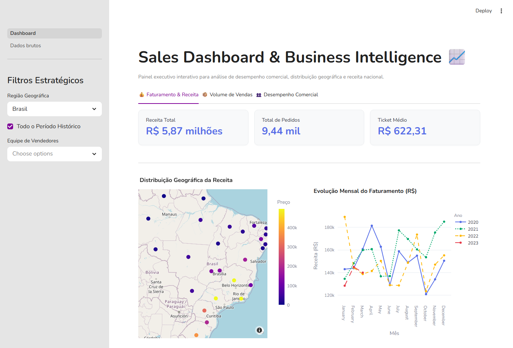
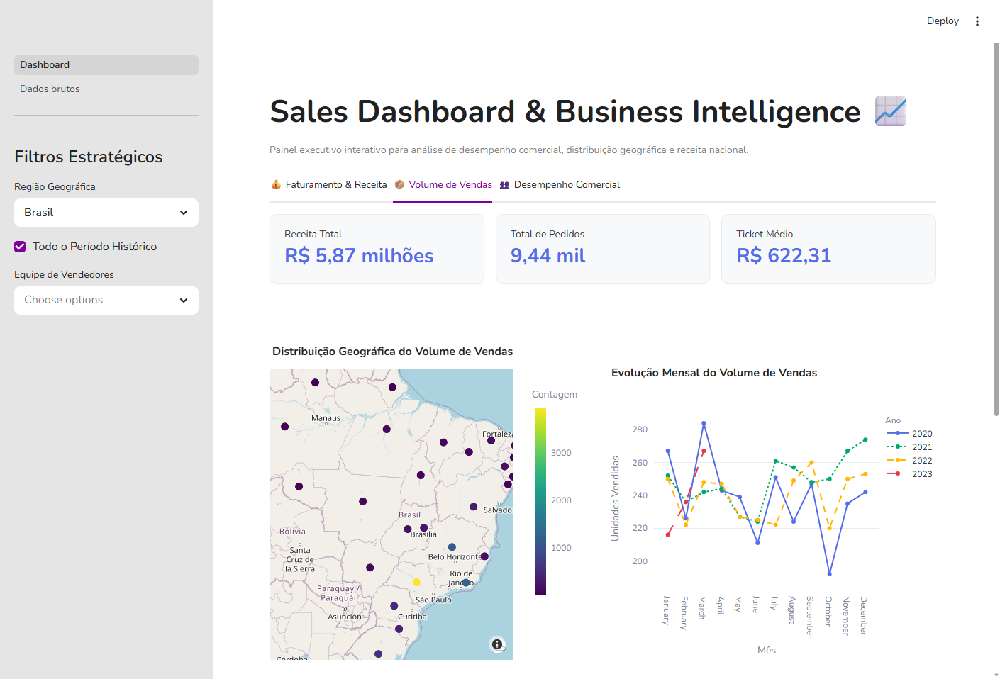
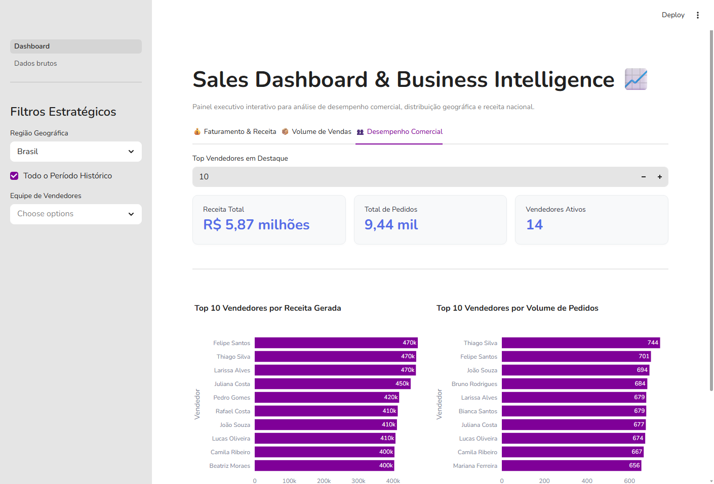
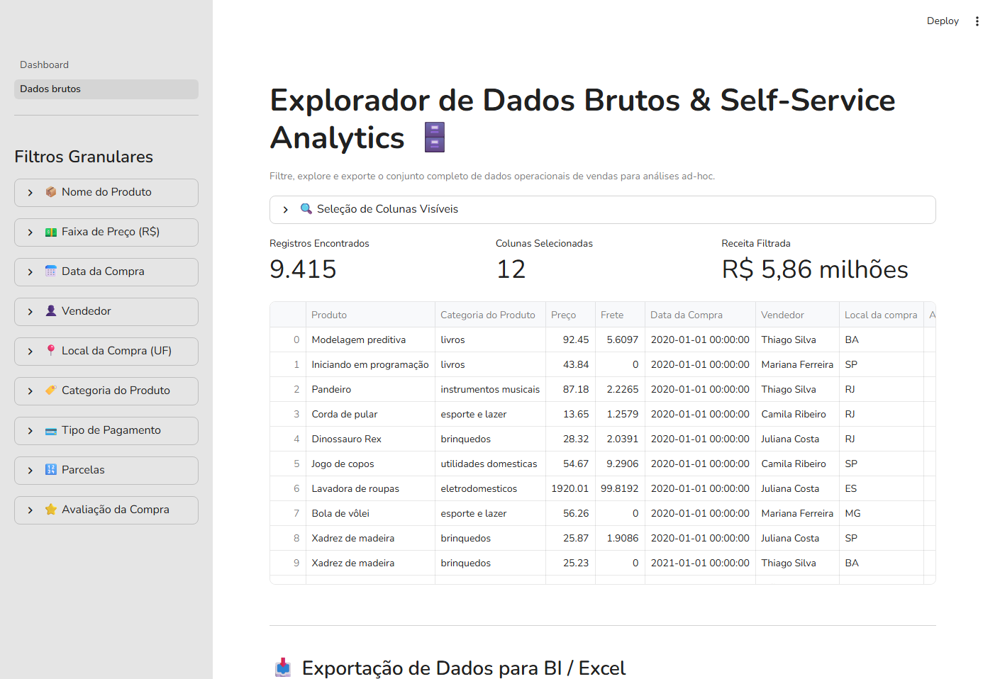

# Executive Sales Dashboard & Business Intelligence 📈

[](https://www.python.org/)
[](https://streamlit.io/)
[](https://plotly.com/)
[](https://pandas.pydata.org/)
[-00C853?style=for-the-badge&logo=streamlit&logoColor=white)](https://streamlit.io/cloud)
[](https://opensource.org/licenses/MIT)

> **Solução de Business Intelligence E2E (End-to-End)** para monitoramento estratégico de vendas nacionais em e-commerce. Construído em Python e Streamlit, o projeto integra consumo de API REST, engenharia de métricas comerciais, visualizações geoespaciais interativas e exportação self-service de dados brutos.

---

## 🎯 Visão Geral & Problema de Negócio

Empresas de e-commerce que operam em escala nacional frequentemente enfrentam o desafio de descentralização de dados comerciais. Decisores precisam de uma visão rápida, fluida e consolidada sobre:
- **Performance Financeira**: Qual o faturamento real e como ele se comporta mês a mês?
- **Eficiência Comercial**: Qual o Ticket Médio (AOV) e quais categorias/vendedores impulsionam a receita?
- **Distribuição Geográfica**: Em quais estados e regiões se concentram as vendas e onde há gargalos comerciais?

Este projeto resolve essa dor de negócio entregando um **Dashboard Executivo Interativo** completo, otimizado para tomada de decisão em tempo real e com **custo zero de infraestrutura**.

---

## 🖼️ Showcase do Dashboard (Demonstração Visual)

O entregável possui 3 visões estratégicas no painel principal e 1 página dedicada para exploração operacional de dados brutos:

### 1. Visão de Faturamento & Receita 💰
*Foco em métricas financeiras globais (Receita Total, Pedidos e Ticket Médio), acompanhamento mensal de faturamento, top estados por receita e mapa geoespacial com intensidade de vendas por coordenada.*



---

### 2. Visão de Volume de Vendas 📦
*Análise focada em tração de volume: unidades comercializadas por estado, sazonalidade mensal por ano (2020-2023) e penetração de volume por categoria de produto.*



---

### 3. Desempenho Comercial & Vendedores 👥
*Ranking dinâmico da equipe comercial (Top N selecionável), permitindo comparar quais representantes possuem maior ticket/faturamento vs. maior volume de pedidos convertidos.*



---

### 4. Explorador de Dados Brutos & Self-Service Analytics 🗄️
*Página de governança e autonomia para a equipe operacional. Permite aplicar múltiplos filtros granulares (faixa de preço, período, vendedor, avaliação, parcelamento) e exportar relatórios customizados diretamente em CSV.*



---

## 🧠 Aprendizados & Competências de Analista de Dados Pleno

Desenvolver este projeto permitiu aplicar e consolidar metodologias avançadas de **Análise de Dados e Engenharia de BI**:

### 1. Ingestão de Dados via API REST & Pipeline ETL
- **Consumo de APIs assíncronas**: Integração do pipeline em Python utilizando `requests` com tratamento de exceções, parâmetros de consulta dinâmicos (`regiao`, `ano`) e timeouts defensivos.
- **Tratamento e Normalização Pandas**: Conversão de estruturas JSON aninhadas para DataFrames, higienização de tipos de dados (Datas no formato `%d/%m/%Y`), fusão (`merge`) de coordenadas geográficas (`lat`, `lon`) com agregações estaduais.

### 2. Otimização de Performance & Caching (`@st.cache_data`)
- **Redução de latência de rede**: Uso do decorador `@st.cache_data(ttl=3600)` para armazenar requisições em cache local por 1 hora, eliminando requisições redundantes à API e garantindo navegação instantânea para o usuário final.

### 3. Modelagem de KPIs & Análise Financeira
- **Cálculo de Indicadores Chave**: Modelagem de **Receita Total (Gross Revenue)**, **Volume de Pedidos (Order Volume)** e **Ticket Médio (AOV - Average Order Value)**.
- **Agregações Temporais Complexas**: Reamostragem mensal (`pd.Grouper(freq='ME')`) para análise de sazonalidade ano a ano.

### 4. UX/UI & Data Storytelling com Plotly
- **Visualização Geoespacial Gratuita**: Utilização do mapa `open-street-map` do Plotly para visualização de densidade territorial sem dependência de chaves pagas (Mapbox API token).
- **Design System Executivo**: Aplicação de CSS customizado nos componentes do Streamlit (`st.metric`, `st.tabs`), paletas de cores harmônicas e feedbacks visuais (`st.spinner`, `st.warning`).

---

## 💡 Praticidade e Custo Zero (Custo R$ 0,00)

Um dos maiores diferenciais deste projeto como entregável de BI é a sua **viabilidade financeira e facilidade de implantação**:

| Característica | Ferramentas Tradicionais (Power BI / Tableau) | Esta Solução (Python + Streamlit) |
| :--- | :--- | :--- |
| **Custo de Licenciamento** | **US$ 10 a US$ 70 / usuário / mês** (Power BI Pro/Premium ou Tableau Creator) | **R$ 0,00 / mês** (100% Open Source) |
| **Hospedagem na Nuvem** | Requer infraestrutura corporativa ou locação de Workspace | **R$ 0,00 / mês** via Streamlit Community Cloud |
| **Customização Visual** | Limitada aos visuais nativos e regras da ferramenta | **Infinita** (CSS customizado, HTML, Plotly) |
| **Atualização dos Dados** | Requer agendamento de Gateway ou Dataflow | **Automática** ao carregar o app ou expirar o cache |
| **Deploy & Versionamento** | Complexo / Manual | **Git Ops**: Push no GitHub faz deploy automático |

---

## 📁 Estrutura do Repositório

```text
dash_vendas_st/
├── Dashboard.py           # Aplicação principal (Painel Executivo e KPIs)
├── utils.py               # Módulo de utilidades (ETL, Cache da API e Formatação)
├── requirements.txt       # Dependências de bibliotecas Python
├── README.md              # Documentação completa do repositório
├── .gitignore             # Arquivo de exclusão do Git
├── .streamlit/
│   └── config.toml        # Configuração de temas e cores do Streamlit
├── assets/                # Screenshots do dashboard exibidas no README
│   ├── dash_receita.png
│   ├── dash_vendas.png
│   ├── dash_vendedores.png
│   └── dados_brutos.png
└── pages/
    └── Dados brutos.py    # Página de consulta e exportação de dados brutos
```

---

## ⚙️ Como Executar Localmente

### Pré-requisitos
- Python 3.10 ou superior instalado.

### Passo a Passo

1. **Clonar o repositório:**
   ```bash
   git clone https://github.com/SEU_USUARIO/dash_vendas_st.git
   cd dash_vendas_st
   ```

2. **Criar e ativar o ambiente virtual (VENV):**
   - **Windows (PowerShell):**
     ```powershell
     python -m venv venv
     .\venv\Scripts\activate
     ```
   - **Linux / macOS:**
     ```bash
     python3 -m venv venv
     source venv/bin/activate
     ```

3. **Instalar as dependências:**
   ```bash
   pip install -r requirements.txt
   ```

4. **Executar a aplicação:**
   ```bash
   python -m streamlit run Dashboard.py
   ```

5. **Acessar no navegador:**
   O Streamlit abrirá automaticamente em `http://localhost:8501`.

---

## 👤 Autor

Desenvolvido por **Mykael Querido** como parte do portfólio profissional de **Análise de Dados & Business Intelligence**.

- 💼 **LinkedIn**: [https://linkedin.com/in/mykael-querido](https://www.linkedin.com/in/mykaelquerido)
- 🐙 **GitHub**: [https://github.com/MykaQMS](https://github.com/MykaQMS)
- 📧 **E-mail**: [mykaqms@gmail.com](mykaqms@gmail.com)
